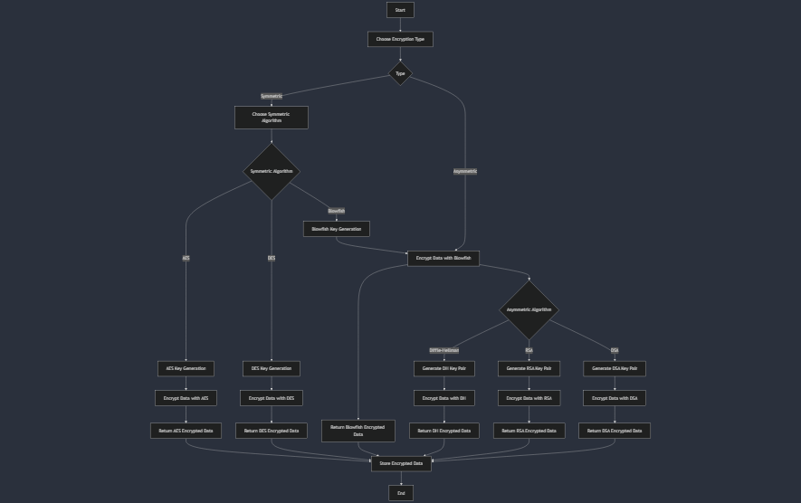
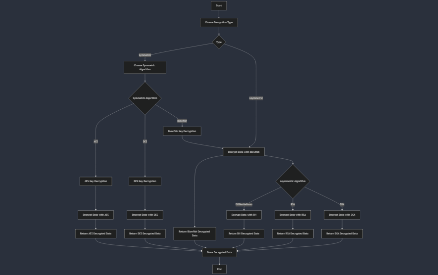
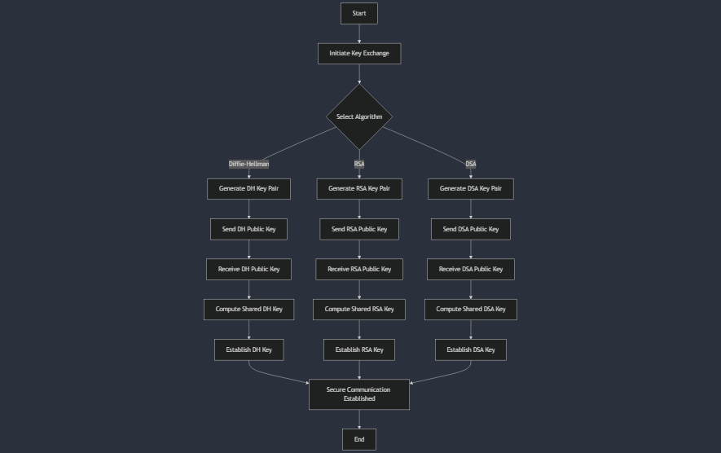
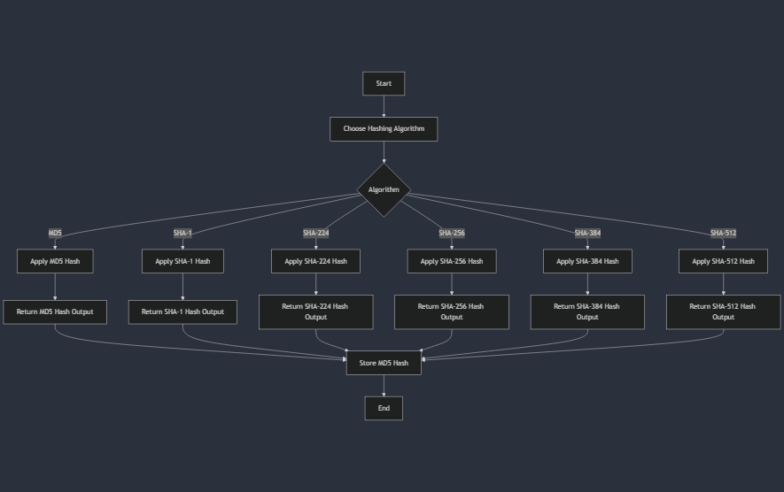

<link rel="stylesheet" type="text/css" href="style.css">

<!-- 
Author: Pirate-Emperor
Date: [Insert Date]
Description: README file for Enigma project.
-->

# Enigma


## Project Overview

Enigma is a Java-based application designed to develop a secure and efficient cryptographic system. It implements various cryptographic algorithms and techniques to ensure data confidentiality, integrity, and authentication. The system incorporates modern cryptographic standards to provide robust security features.

## Cryptographic Algorithms

### Symmetric Algorithms
1. **AES Encryption**: Advanced Encryption Standard for secure data encryption.
2. **DES Encryption**: Data Encryption Standard for encrypting data.
3. **Blowfish Encryption**: A symmetric-key block cipher designed for high performance.

### Asymmetric Algorithms
1. **Diffie-Hellman Cipher**: A method for securely exchanging cryptographic keys.
2. **RSA Cipher**: A widely used public-key encryption algorithm.
3. **DSA Cipher**: Digital Signature Algorithm for secure digital signatures.

### Hashing Algorithms
1. **MD5**: Message Digest Algorithm 5, a widely used hash function.
2. **SHA-1**: Secure Hash Algorithm 1, designed for cryptographic security.
3. **SHA-224**: A variant of SHA-2 with a 224-bit hash.
4. **SHA-256**: Secure Hash Algorithm 256-bit, part of the SHA-2 family.
5. **SHA-384**: SHA-2 family hash with a 384-bit output.
6. **SHA-512**: SHA-2 family hash with a 512-bit output.

## Technologies Used

1. **Java**: The primary programming language for cryptographic implementations.
2. **Gradle**: Build automation tool used for project management.
3. **Android Studio**: Integrated development environment for Android app development.
4. **Fragment**: Modular component for building dynamic UI in Android applications.
5. **XML**: Markup language used for defining layout and configuration files.
6. **Side Navigation Drawer**: Provides navigation options within the application.

## Project Directory Structure

Here's an overview of the project directory structure and the purpose of each file and folder:

### Root Directory

- **`.gradle/`**: Contains Gradle configuration files.
- **`build/`**: Build output directory created by Gradle.
- **`src/`**: Source code and resources directory.
  - **`main/`**:
    - **`java/`**:
      - **`com/PirateEmperor/Enigma/`**:
        - **`crypto/`**: Contains implementations of cryptographic algorithms.
        - **`ui/`**: Contains classes for user interface components.
        - **`utils/`**: Utility classes for various functions.
      - **`CryptoApplication.java`**: Main application class.
    - **`res/`**:
      - **`layout/`**: XML layout files for the application.
      - **`values/`**: XML files for strings, colors, and styles.
  - **`test/`**:
    - **`java/`**:
      - **`com/PirateEmperor/Enigma/`**:
        - **`crypto/`**: Tests for cryptographic algorithms.
        - **`ui/`**: Tests for user interface components.
        - **`utils/`**: Tests for utility functions.

- **`.gitignore`**: Specifies files and directories to be ignored by Git.
- **`build.gradle`**: Gradle build configuration file.
- **`settings.gradle`**: Settings file for Gradle.
- **`README.md`**: This README file.

## Flow Charts

### 1. Encryption Flow


### 2. Decryption Flow


### 3. Key Exchange Flow


### 4. Hashing Flow


## SDLC

The Software Development Life Cycle (SDLC) for Enigma includes:

1. **Requirements Analysis**: Defining the requirements for secure cryptographic operations.
2. **Design**: Creating system architecture, flowcharts, and detailed design documents for encryption and decryption processes.
3. **Implementation**: Coding cryptographic algorithms and user interface components using Java and Gradle.
4. **Testing**: Conducting unit and integration tests to ensure the correctness and security of the cryptographic functions.
5. **Deployment**: Deploying the application to a development or production environment.
6. **Maintenance**: Monitoring, bug fixing, and updating the application based on user feedback.

## Highlight Testing Scripts

Testing is crucial for ensuring the reliability of cryptographic functions:

- **`CryptoAlgorithmTests.java`**: Validates the correctness of encryption and decryption algorithms.
- **`HashingTests.java`**: Tests various hashing algorithms for data integrity.
- **`KeyExchangeTests.java`**: Ensures the security and functionality of key exchange mechanisms.
- **`UiTests.java`**: Tests user interface components and interactions.

Testing ensures that all cryptographic features work as intended and meet security standards.

## Skills Used

- **Java**: Primary programming language for implementing cryptographic algorithms.
- **Gradle**: Build tool for managing project dependencies and builds.
- **Android Studio**: IDE for developing and testing Android applications.
- **Fragment**: UI component for modular and dynamic user interfaces.
- **XML**: Used for defining layout and configuration.

## Steps to Run

Follow these steps to set up and run the Enigma project:

### 1. Clone the Repository

Clone the repository using Git:

```bash
git clone https://github.com/Pirate-Emperor/Enigma.git
```

### 2. Set JAVA_HOME Environment Variable

Ensure that the `JAVA_HOME` environment variable is set to the JDK version specified in the `build.gradle` file.

- **Download JDK**: [Download JDK](https://www.oracle.com/java/technologies/javase-jdk11-downloads.html)
- **Set JAVA_HOME**:

  - **Windows**:
    1. Open Command Prompt and set the environment variable:
       ```bash
       setx JAVA_HOME "C:\path\to\jdk"
       ```
    2. Verify the setting:
       ```bash
       echo %JAVA_HOME%
       ```

  - **macOS/Linux**:
    1. Edit your shell configuration file (`.bashrc`, `.bash_profile`, `.zshrc`, etc.) and add:
       ```bash
       export JAVA_HOME=/path/to/jdk
       ```
    2. Apply the changes:
       ```bash
       source ~/.bashrc
       ```

### 3. Build the Project

Use Gradle to build the project:

```bash
gradle build
```

### 4. Run the Application

Start the application from Android Studio or use the following command:

```bash
gradle run
```

### 5. Test the Application

Run unit tests to ensure functionality:

```bash
gradle test
```

## Contributing

Feel free to fork the repository, make changes, and submit pull requests. Contributions are welcome!

## License

This project is licensed under the MIT License. See the [LICENSE](LICENSE) file for details.

## Author

**Pirate-Emperor**

[](https://twitter.com/PirateKingRahul)
[](https://discord.com/users/1200728704981143634)
[](https://www.linkedin.com/in/piratekingrahul)

[](https://www.reddit.com/u/PirateKingRahul)
[](https://medium.com/@piratekingrahul)

- GitHub: [Pirate-Emperor](https://github.com/Pirate-Emperor)
- Reddit: [PirateKingRahul](https://www.reddit.com/u/PirateKingRahul/)
- Twitter: [PirateKingRahul](https://twitter.com/PirateKingRahul)
- Discord: [PirateKingRahul](https://discord.com/users/1200728704981143634)
- LinkedIn: [PirateKingRahul](https://www.linkedin.com/in/piratekingrahul)
- Skype: [Join Skype](https://join.skype.com/invite/yfjOJG3wv9Ki)
- Medium: [PirateKingRahul](https://medium.com/@piratekingrahul)

Thank you for visiting the Enigma project!
---

For more details, please refer to the [GitHub repository](https://github.com/Pirate-Emperor/Enigma).
